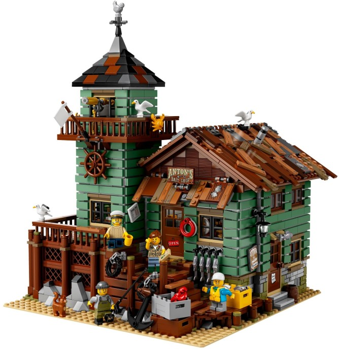

# Old Fishing Store (21310-1)

**Beskrivning:** 
Visit the beachside Old Fishing Store, featuring a shop packed with fishing-themed elements, and a connected watchtower with a 360-degree viewing balcony and office on the lower level. Ideal for display and role-play, this model has 2 removable roofs, an opening back wall in the shop for easy access, 4 minifigures, cat and 3 seagull figures, as well as loads of other cool details and elements to fire up the imagination.

<ul>
	<li>Includes 4 minifigures: a captain, fisherman, fisherwoman and a child, plus cat and 3 seagull figures.</li>
	<li>Old Fishing Store features a detailed exterior, shop and connected lookout tower with office, all standing on a sand-colored LEGO&reg; 32x32 baseplate with rock-style elements.</li>
	<li>Exterior features steps to the front and side doors of the store, railings, a tap with 2 pipes with meters on the back wall, ventilator and assorted elements including: &lsquo;Anton&#39;s Bait Shop&#39; sign (2x4 tile), opening times sign, &lsquo;gone fishin&rsquo;&rsquo; sign, anchor, barrel, 2 tires with chains, 3 crates with 2 fish and transparent ice-style elements, 4 fish hanging on hooks, 2 life preservers, box of hooks (1x2 tile), and a toolbox with a drill, oil can and wrench.</li>
	<li>Shop features an opening back wall and removable roof with mismatched timber-style elements and decorative stickers, 2 ceiling light elements, 2 opening entrance doors, 2 glass-style windows, green and beige floor tiles, 4 opening windows, shop counter, display racks, plus assorted elements including: cash register, mug, bottle, hook boxes, cash, desktop lamp, 2 oars, fishing gear including rods, harpoons and fishing nets, 3 diving helmets, 3 oxygen tanks, 4 diving flippers, a sextant, decorated map tile, TNT box, plus a spider and spider&#39;s web under the floor.</li>
	<li>Lookout tower lower level features an office with 2 opening windows, boarded-up window with newspaper sticker, desk, chair, lamp and newspaper elements, plus a ladder to the upper level.</li>
	<li>Lookout tower upper level features a removable roof with a weather vane, 2 opening windows, 360-degree viewing balcony, plus assorted elements including a telescope, flag, ship&rsquo;s wheel, lantern and 2 decorative crabs.</li>
	<li>Great for display or role-play fun.</li>
	<li>Includes a booklet about the fan designer and LEGO&reg; designer of this set.</li>
	<li>This set includes over 2,045 pieces.</li>
	<li>Measures over 12&rdquo; (32cm) high, 9&rdquo; (25cm) wide and 9&rdquo; (25cm) deep.</li>
</ul>

[Se på Brickset](https://brickset.com/sets/21310-1)
